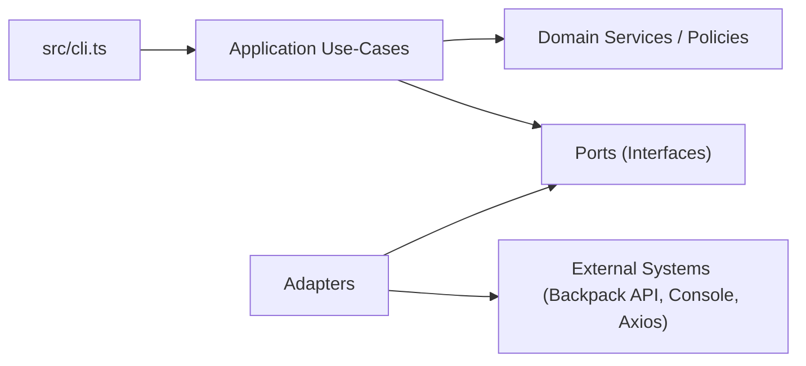

# ARCHITECTURE

Last updated: 2026-02-13

## Purpose

This document describes the current architecture of `miau-trader`, a TypeScript CLI that generates trade recommendations from Backpack public market data.

## Architectural Style

The project follows a clean-architecture style with strict layer boundaries:

- `src/domain/`: pure trading logic and policies
- `src/application/`: orchestration and use-cases
- `src/ports/`: interfaces for external dependencies
- `src/adapters/`: concrete implementations of ports
- `src/cli.ts`: composition root and runtime control flow

Core rules:

- Domain must not depend on adapters.
- Application depends on domain + ports only.
- Adapters implement ports and can depend on external libraries.

## Layer Responsibilities

### Domain (`/Users/bene/Workspace/bene/miau/src/domain`)

Primary responsibilities:

- indicator calculation (`indicator-service.ts`)
- signal/confidence scoring and level generation (`recommendation-engine.ts`)
- objective/horizon targeting policy (`targeting-policy.ts`)
- simulation outcome evaluation (`simulation-evaluator.ts`)
- rec-mode probability scoring (`positive-pnl-probability.ts`)
- domain types (`types.ts`)

Characteristics:

- deterministic, testable logic
- no I/O or network calls

### Application (`/Users/bene/Workspace/bene/miau/src/application`)

Primary responsibilities:

- parse global CLI mode (`parse-cli-input.ts`)
- parse per-symbol interactive input (`parse-trading-input.ts`, `parse-trading-symbol.ts`)
- generate recommendation by orchestrating market data + domain services (`generate-recommendation-use-case.ts`)
- rank top opportunities for `rec` mode (`rank-top-opportunities-use-case.ts`)

Characteristics:

- coordinates domain and ports
- no direct dependency on concrete HTTP or console implementations

### Ports (`/Users/bene/Workspace/bene/miau/src/ports`)

Defined contracts:

- market data retrieval (`market-data-port.ts`)
- logging (`logger-port.ts`)

### Adapters (`/Users/bene/Workspace/bene/miau/src/adapters`)

Concrete implementations:

- Backpack market data adapter (`backpack/backpack-market-data-client.ts`)
- HTTP adapter via Axios (`http/axios-http-client.ts`)
- console output and logging adapters (`console/*`)

## Runtime Composition

`/Users/bene/Workspace/bene/miau/src/cli.ts` composes the system:

1. Parse CLI mode (`interactive` or `rec`).
2. Instantiate adapters and services:
   - `AxiosHttpClient`
   - `BackpackMarketDataClient`
   - `IndicatorService`
   - `RecommendationEngine`
   - `GenerateRecommendationUseCase`
3. Execute selected runtime flow.

## Runtime Flows

### Interactive flow

1. User enters symbol command in prompt.
2. Application parses symbol and flags (`-i`, `--objective`, `--horizon`, `--manual-levels`, `--simulate`).
3. Quick or full prompt collects remaining inputs.
4. `GenerateRecommendationUseCase` fetches candles + perp snapshot and computes indicators.
5. `RecommendationEngine` produces recommendation.
6. `RecommendationPrinter` renders result.
7. Optional background simulation runs and prints delayed result.

### `rec` flow

1. User runs `miau-trader rec` (via `npm run dev -- rec`).
2. `RankTopOpportunitiesUseCase` loops watchlist symbols.
3. For each symbol:
   - executes normal recommendation pipeline
   - estimates probability of positive PnL
4. Sorts by:
   - probability descending
   - confidence descending
   - risk/reward descending
5. Filters out `NO_TRADE` and returns up to 5 actionable recommendations.

## Dependency Graph

## Key Data Boundaries

- Market boundary:
  - domain receives normalized candles and perp snapshots only
  - Backpack-specific schema mapping stays in adapter
- Presentation boundary:
  - recommendation data model is adapter-agnostic
  - console coloring/formatting stays in console adapter

## Error Handling Strategy

- Parsing/validation errors are raised early with explicit messages.
- Use-cases throw on missing market data or invalid computed states.
- CLI catches and routes errors through `ConsoleLogger`.
- `rec` mode tracks per-symbol failures as skipped entries.

## Testing Strategy

Current test focus aligns with architecture:

- input parsing and validation tests
- recommendation and policy domain tests
- HTTP integration boundary tests with `nock` (no live endpoint dependency in unit tests)

## Known Constraints

- No order placement or trade execution is implemented.
- System is stateless (no database/persistence).
- Architecture is optimized for CLI usage and synchronous request/response with optional async simulation callback.
