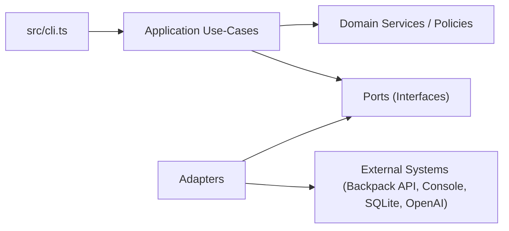

# ARCHITECTURE

Last updated: 2026-02-18

## Purpose

This document describes the current architecture of `miau-trader`, a TypeScript CLI that generates crypto trade recommendations from Backpack public market data.

## Architectural Style

The project follows clean-architecture boundaries:

- `src/domain/`: pure trading logic and policies
- `src/application/`: orchestration and use-cases
- `src/ports/`: interfaces for external dependencies
- `src/adapters/`: concrete implementations (Backpack, console, persistence, AI)
- `src/cli.ts`: composition root and runtime control flow

Core rules:

- Domain does not depend on adapters.
- Application depends on domain + ports only.
- Adapters implement ports and may depend on external libraries.

## Layer Responsibilities

### Domain (`src/domain`)

Primary responsibilities:

- recommendation scoring, confidence, and guard logic (`recommendation-engine.ts`)
- targeting policy (`targeting-policy.ts`)
- simulation outcome evaluation (`simulation-evaluator.ts`)
- rec-mode probability model (`positive-pnl-probability.ts`)
- shared domain types (`types.ts`)

Characteristics:

- deterministic, testable logic
- no direct I/O or network calls

### Application (`src/application`)

Primary responsibilities:

- generate a recommendation (`generate-recommendation-use-case.ts`)
- generate optional AI advisory (`generate-ai-advice-use-case.ts`)
- rank top opportunities (`rank-top-opportunities-use-case.ts`)
- adaptive learning policy orchestration (`adaptive-learning-service.ts`)
- recommendation ranking orchestration (`run-recommendation-ranking-use-case.ts`)
- learning cycle orchestration (`run-learning-cycle-use-case.ts`)
- watch/simulation orchestration (`evaluate-watch-symbol-use-case.ts`, `evaluate-simulation-use-case.ts`)
- shared timeframe/learning policy helpers (`timeframe-policy.ts`, `learning-gates-policy.ts`)

### Ports (`src/ports`)

Defined contracts:

- market data retrieval (`market-data-port.ts`)
- logging (`logger-port.ts`)
- AI advisory (`ai-advisor-port.ts`)
- learning persistence (`learning-store-port.ts`)
- indicator calculation (`indicator-calculator-port.ts`)
- recommendation policy (`recommendation-policy-port.ts`)

### Adapters (`src/adapters`)

Concrete implementations:

- Backpack market data (`backpack/backpack-market-data-client.ts`)
- HTTP adapter (`http/axios-http-client.ts`)
- console parsing/rendering/logging (`console/*`)
- technical indicator implementation (`indicators/technical-indicator-service.ts`)
- SQLite learning store (`persistence/sqlite-learning-store.ts`)
- OpenAI AI advisor (`ai/openai-ai-advisor.ts`)

## Runtime Composition

`src/cli.ts` composes the runtime:

1. Validate startup arguments (no startup args supported).
2. Instantiate adapters and services:
   - `AxiosHttpClient`
   - `BackpackMarketDataClient`
   - `TechnicalIndicatorService`
   - `RecommendationEngine`
   - `GenerateRecommendationUseCase`
   - `AdaptiveLearningService` (with SQLite store)
   - `GenerateAiAdviceUseCase`
   - `RecommendationPrinter`
3. Execute the interactive loop (all user commands are in-app).

## Runtime Flows

### Interactive flow (default)

1. User starts app with `npm run dev`.
2. User enters commands at prompt:
   - trading queries (`SYMBOL [minutes] [long|short] [flags]`)
   - `rec`, `defaults`, `watch`, `unwatch`
   - `learn --start|--stop|--stats`
3. Parser normalizes symbol input and supported flags (`--custom`, `--horizon`, `--expected`, `--simulate`, `--ai`).
4. Use-case fetches candles/perp context and computes recommendation.
5. Learning policy may calibrate confidence/quality gates.
6. Console adapter renders dashboard + latest single-symbol output.
7. Optional simulation runs asynchronously and feeds learning persistence.

### `rec` flow

1. User runs `rec` inside interactive mode.
2. App fetches top 15 PERP symbols by 24h volume + open interest.
3. Recommendation pipeline runs per symbol.
4. Positive-PnL probability ranking sorts actionable setups.
5. Console prints top 5 recommendations.

## Persistence Model

Local persistence is intentionally used:

- learning outcomes: `data/learning.sqlite`
- trade defaults: `data/trade-defaults.json`

No external database service is used.

## Dependency Graph

```mermaid
flowchart LR
  CLI["src/cli.ts"] --> APP["Application Use-Cases"]
  APP --> DOMAIN["Domain Services / Policies"]
  APP --> PORTS["Ports (Interfaces)"]
  ADAPTERS["Adapters"] --> PORTS
  ADAPTERS --> EXT["External Systems (Backpack API, Console, SQLite, OpenAI)"]
```

## Testing Strategy

Current test focus:

- parser and validation behavior
- domain recommendation/targeting/simulation logic
- integration boundaries with HTTP mocking (`nock`)
- application-layer orchestration (ranking, AI mapping, adaptive learning)

## Known Constraints

- No trade execution or private-account integration.
- Works as a CLI-first application (interactive and rec modes).
