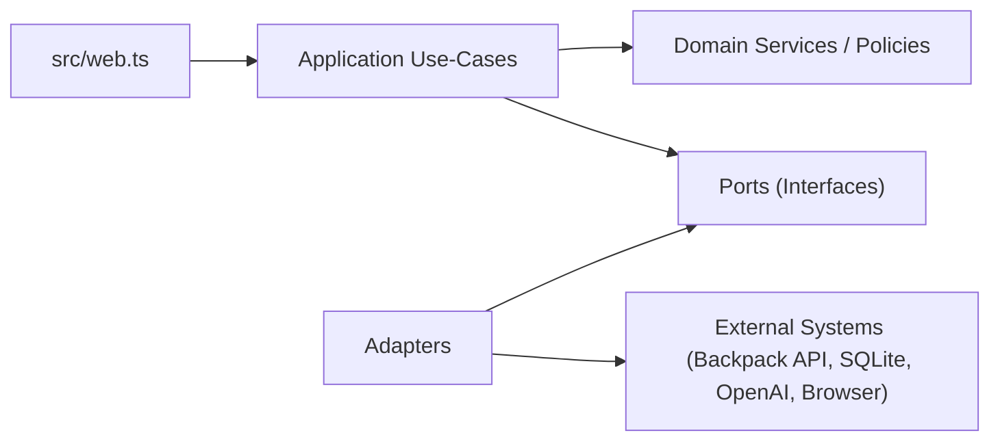

# ARCHITECTURE

Last updated: 2026-03-13

## Purpose

This document describes the current architecture of `miau-trader`, a TypeScript web application that analyzes crypto markets and reevaluates open trades using Backpack public market data.

## Architectural Style

The project follows clean-architecture boundaries:

- `src/domain/`: pure trading logic and policies
- `src/application/`: orchestration and use-cases
- `src/ports/`: interfaces for external dependencies
- `src/adapters/`: concrete implementations (Backpack, web, persistence, AI, logging)
- `src/web.ts`: composition root and runtime startup

Core rules:

- Domain does not depend on adapters.
- Application depends on domain + ports only.
- Adapters implement ports and may depend on external libraries.

## Layer Responsibilities

### Domain (`src/domain`)

Primary responsibilities:
- recommendation scoring, confidence, playbook, readiness, and guard logic
- targeting policy and execution-cost-aware trade math
- open-trade monitoring metrics, health, and management evaluation
- simulation outcome evaluation
- shared domain types

Characteristics:
- deterministic, testable logic
- no direct I/O or network calls

### Application (`src/application`)

Primary responsibilities:
- generate a recommendation
- apply adaptive learning policy
- rank top opportunities
- build and reevaluate open-trade monitor state
- orchestrate learning bucket reports and learning cycles
- generate optional AI advisory

### Ports (`src/ports`)

Defined contracts:
- market data retrieval
- live market data stream access
- logging
- AI advisory
- learning persistence
- indicator calculation
- trade defaults persistence
- recommendation policy

### Adapters (`src/adapters`)

Concrete implementations:
- Backpack REST market data adapter
- Backpack WebSocket live-market adapter for the monitor fast lane
- HTTP adapter
- technical indicator implementation (`talib-wasm`)
- SQLite learning and defaults stores
- OpenAI AI advisor
- web server, API handler, and static frontend
- stdout logger for process-level startup/errors

## Runtime Composition

`src/web.ts` composes the runtime:

1. Instantiate process-level dependencies:
   - `StdoutLogger`
   - `AxiosHttpClient`
   - `BackpackMarketDataClient`
   - `BackpackLiveMarketStreamClient`
   - indicator service
2. Instantiate core services:
   - `RecommendationEngine`
   - `GenerateRecommendationUseCase`
   - `AdaptiveLearningService`
   - `RunRecommendationRankingUseCase`
   - `BuildOpenTradeBaselineUseCase`
   - `EvaluateOpenTradeUseCase`
3. Instantiate the web adapter surface:
   - `WebServer`
   - `WebApiHandler`
   - static assets under `src/adapters/web/static`
4. Start the HTTP server.

## Runtime Flows

### Analyze flow

1. Browser posts to `POST /api/analyze`.
2. Web API handler loads defaults and resolves adaptive timeframes.
3. Recommendation generation runs against Backpack public market data.
4. Adaptive learning policy is applied.
5. Optional AI advisory is generated if enabled.
6. Response is rendered in the frontend.

### Scanner flow

1. Browser requests `GET /api/scan`.
2. Ranking use-case loads defaults.
3. Ranking runs the same live recommendation path as single-symbol analysis, without AI.
4. Results are sorted and rendered in the frontend.

### Open-trade monitor flow

1. Browser opens `GET /api/monitor/stream` with manual trade levels.
2. Web server builds one baseline trade-monitor snapshot.
3. Fast lane opens a Backpack public WebSocket stream for the monitored symbol and updates live perp state from:
   - `bookTicker.<symbol>`
   - `markPrice.<symbol>`
   - `openInterest.<symbol>`
4. Fast lane uses the latest live perp snapshot for price, spread, unrealized PnL, current `R`, stop/target distance, and MFE/MAE.
5. Slow lane periodically refreshes recommendation context for regime, playbook alignment, sequence, key-level interaction, thesis health, and management action.
6. If the WebSocket stream cannot be established, the monitor falls back to REST snapshot polling for the fast lane.
7. Browser receives updates over SSE and redraws the monitor view.

### Learning / settings flow

1. Browser requests learning stats or defaults endpoints.
2. Web API handler uses SQLite-backed services.
3. Results are returned as JSON and rendered by the frontend.

## Persistence Model

Local persistence only:
- learning outcomes: `data/learning.sqlite`
- trade defaults: `data/learning.sqlite`

No external database service is used.

## Dependency Graph

```mermaid
flowchart LR
  WEB["src/web.ts"] --> APP["Application Use-Cases"]
  APP --> DOMAIN["Domain Services / Policies"]
  APP --> PORTS["Ports (Interfaces)"]
  ADAPTERS["Adapters"] --> PORTS
  ADAPTERS --> EXT["External Systems (Backpack API, SQLite, OpenAI, Browser)"]
```

## Testing Strategy

Current test focus:
- domain recommendation, playbook, readiness, and simulation logic
- open-trade monitor domain/application logic
- integration boundaries with HTTP mocking (`nock`)
- Backpack live-stream adapter behavior
- application-layer orchestration (ranking, AI mapping, adaptive learning)

## Known Constraints

- No trade execution or private-account integration.
- Analyze/scanner flows remain snapshot-based by design.
- Only the open-trade monitor uses stream-native market ingestion.
